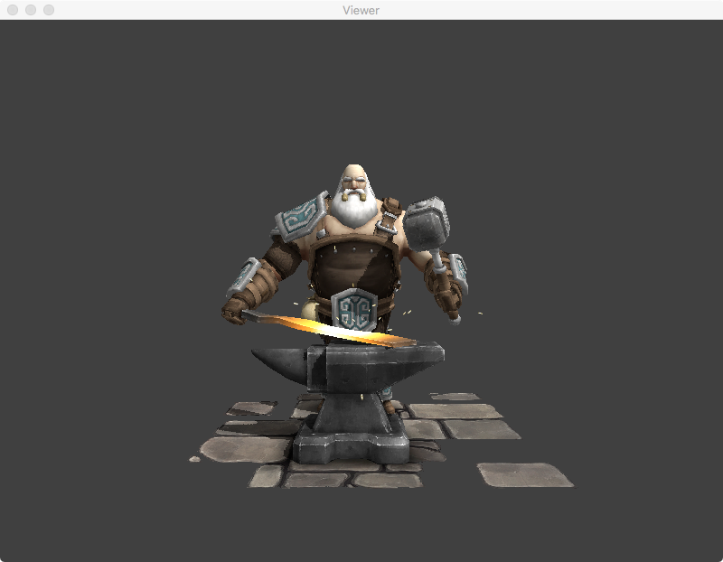
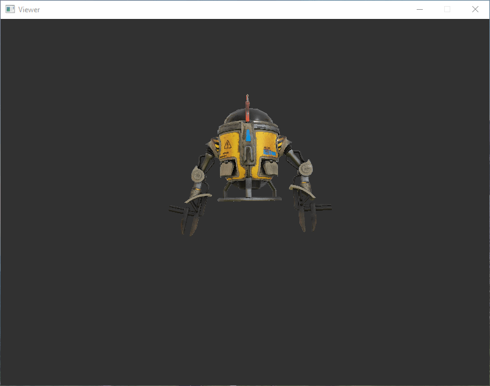
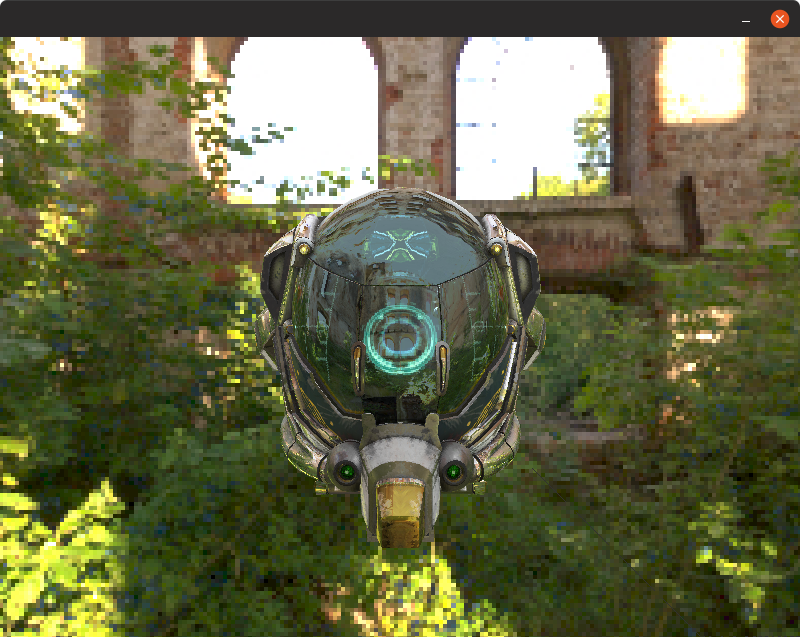
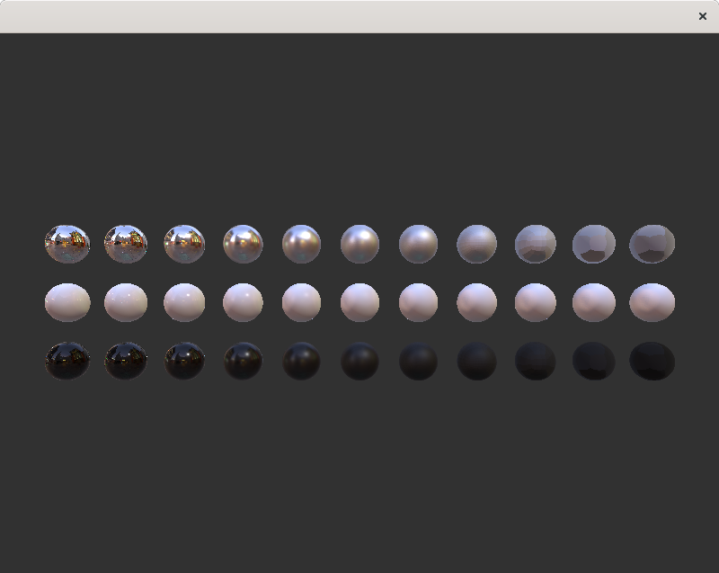

# Software Renderer

This is a shader-based software renderer written from scratch. It is written
in C89 with minimal dependencies, available for Windows, macOS, and Linux.

## Features

* Cross-platform (Windows, macOS, and Linux)
* Minimal dependencies
* Shader-based
* Real-time
* Blinn–Phong reflection model
* Physically based rendering (PBR)
* Metalness workflow
* Specular workflow
* Image-based lighting (IBL)
* Normal mapping
* Shadow mapping
* Cubemapped skybox
* Skeletal animation
* Orbit camera control
* Back-face culling
* Homogeneous clipping
* Perspective-correct interpolation
* Depth testing
* Alpha testing
* Alpha blending
* Platform abstraction layer (window, event, and timer)
* Math library (vector, matrix, and quaternion)
* Mesh loading (obj, gltf)
* Image loading (tga, hdr)

## Download

[Binaries](https://github.com/zauonlok/renderer/releases) for Windows, macOS,
and Linux are available.

## Build

To build the renderer from source, a C89 compiler and development files for
your window system are required.

### Windows

Install [Visual Studio](https://visualstudio.microsoft.com/downloads/) and
run `build_win32.bat`.

### macOS

Install [Xcode](https://itunes.apple.com/us/app/xcode/id497799835?mt=12) and
run `build_macos.sh`.

### Linux

Install GCC and Xlib with the following commands and run `build_linux.sh`.

#### Ubuntu / Debian

```
sudo apt install gcc libx11-dev
```

#### Fedora / RHEL

```
sudo dnf install gcc libX11-devel
```

#### openSUSE / SUSE

```
sudo zypper install gcc libX11-devel
```

## Usage

### Launch

If the renderer is launched without arguments, one of the available scenes
(see below) will be chosen randomly. To display a specific scene, additional
arguments should be supplied. The command line syntax is:

```
Viewer [test_name [scene_name]]
```

### Controls

* Orbit: left click and drag
* Pan: right click and drag
* Zoom: scroll up or down
* Rotate lighting: <kbd>A</kbd> <kbd>D</kbd> <kbd>S</kbd> <kbd>W</kbd>
* Reset everything: <kbd>Space</kbd>

## Samples

| Scene                                                                                                | Command                  |
| ---------------------------------------------------------------------------------------------------- | ------------------------ |
| [](assets/azura/README.md)                        | `Viewer blinn azura`     |
| [](assets/centaur/README.md)                    | `Viewer blinn centaur`   |
| [](assets/craftsman/README.md)                | `Viewer blinn craftsman` |
| [](assets/elfgirl/README.md)                    | `Viewer blinn elfgirl`   |
| [](assets/kgirl/README.md)                        | `Viewer blinn kgirl`     |
| [](assets/mccree/README.md)                      | `Viewer blinn mccree`    |
| [](assets/nier2b/README.md)                      | `Viewer blinn nier2b`    |
| [](assets/phoenix/README.md)                    | `Viewer blinn phoenix`   |
| [](assets/witch/README.md)                        | `Viewer blinn witch`     |
| [](assets/assassin/README.md)                  | `Viewer pbr assassin`    |
| [](assets/crab/README.md)                          | `Viewer pbr crab`        |
| [](assets/dieselpunk/README.md)              | `Viewer pbr dieselpunk`  |
| [](assets/drone/README.md)                        | `Viewer pbr drone`       |
| [](assets/helmet/README.md)                      | `Viewer pbr helmet`      |
| [](assets/junkrat/README.md)                    | `Viewer pbr junkrat`     |
| [](assets/ornitier/README.md)                  | `Viewer pbr ornitier`    |
| [](assets/ponycar/README.md)                    | `Viewer pbr ponycar`     |
| [](assets/common/footprint/README.md) | `Viewer pbr sphere`      |

## License

[MIT](LICENSE)
