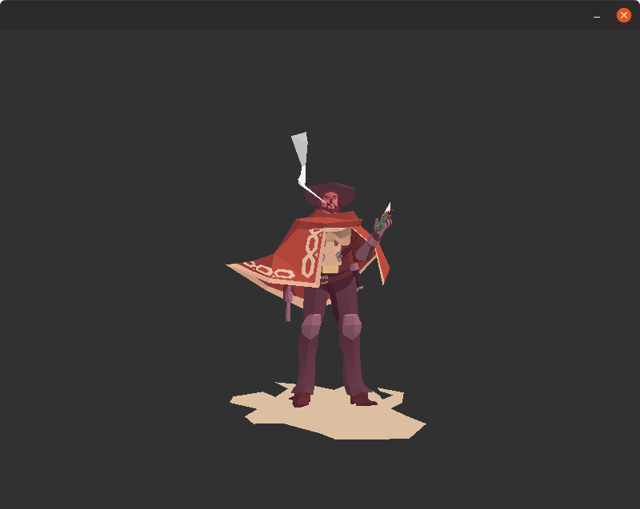
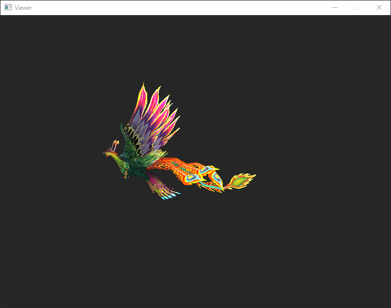
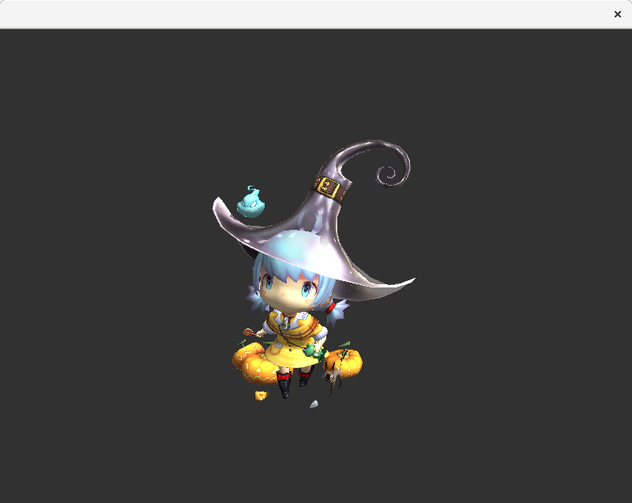
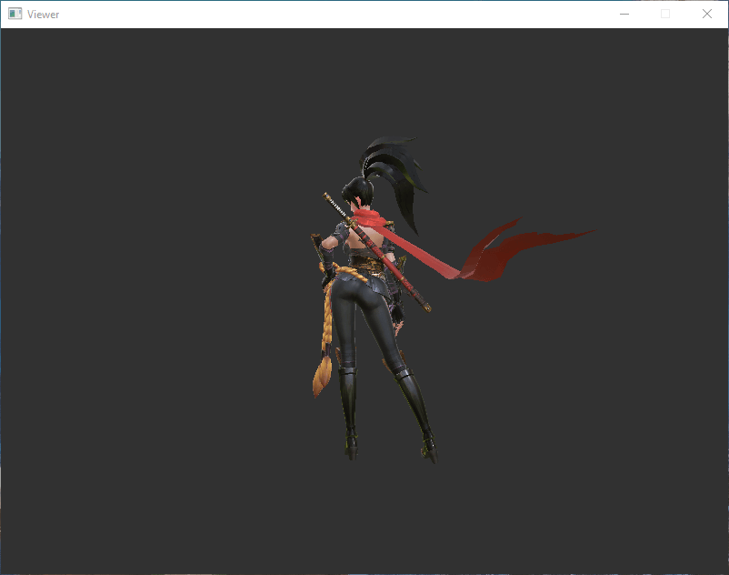
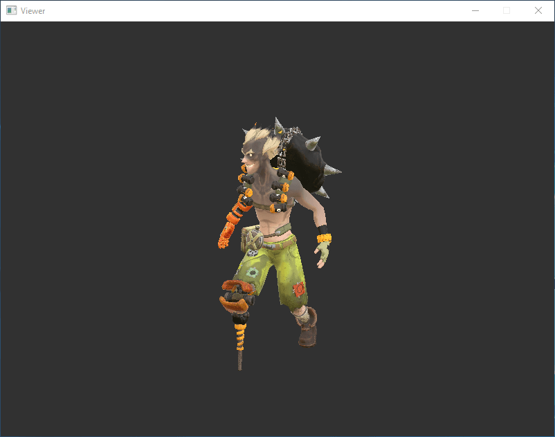
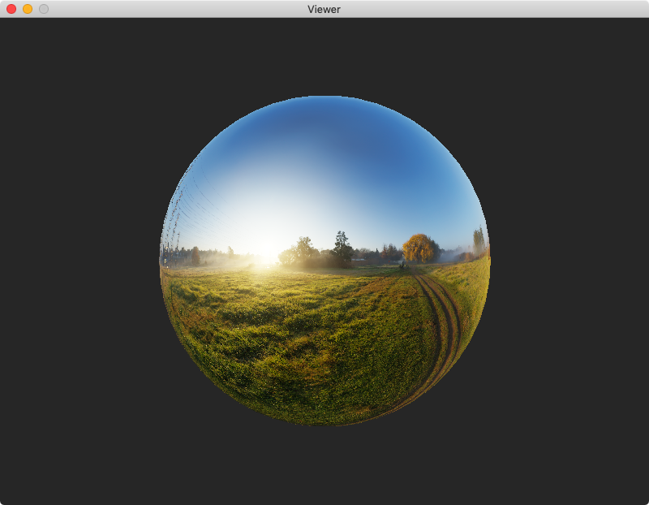
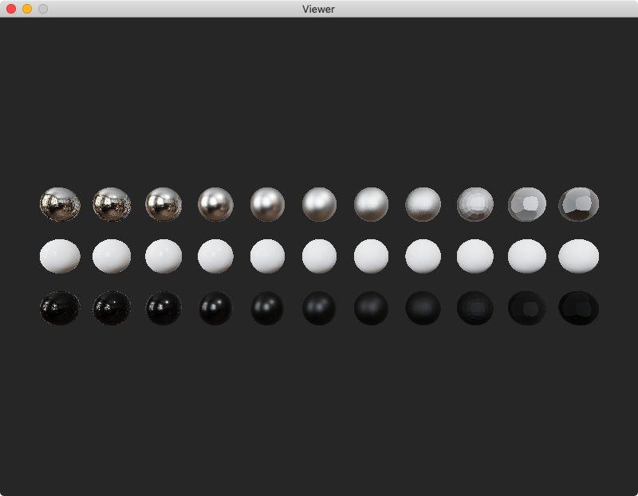

# Software Renderer   

 
 

This is a shader-based software renderer written from scratch in C89 with
minimal dependencies, available for Windows, macOS, and Linux.

## Features

* Cross platform
* Minimal dependencies
* Shader based
* Homogeneous clipping
* Back-face culling
* Perspective correct interpolation
* Depth testing
* Alpha testing
* Alpha blending
* Cubemapped skybox
* Skeletal animation
* Tangent space normal mapping
* Shadow mapping
* ACES tone mapping
* Blinn–Phong reflection model
* Physically based rendering (PBR)
* Metallic-roughness workflow
* Specular-glossiness workflow
* Image-based lighting (IBL)
* Orbital camera controls
* PBR material inspector

## Download

Pre-built binaries for Windows, macOS, and Linux are available for download
from the [Releases page](https://github.com/zauonlok/renderer/releases).

## Build

To build the software renderer from source, a C89 compiler and development
files for your window system are required.

### Windows

Install [Visual Studio](https://visualstudio.microsoft.com/downloads/)
with C++ support and run `build_win32.bat`.

### macOS

Install Command Line Tools for Xcode with the command below and
run `build_macos.sh`.

```
xcode-select --install
```

### Linux

Install GCC and Xlib with the following commands and run `build_linux.sh`.

#### Ubuntu / Debian

```
sudo apt install gcc libx11-dev
```

#### Fedora / RHEL

```
sudo dnf install gcc libX11-devel
```

#### openSUSE / SUSE

```
sudo zypper install gcc libX11-devel
```

### Bonus

A `CMakeLists.txt` file is provided for generating project files using
[CMake](https://cmake.org/) (see examples below).

#### Visual Studio

```
mkdir build
cd build
cmake -G "Visual Studio 16 2019" ..
start Renderer.sln
```

#### Xcode

```
mkdir build
cd build
cmake -G Xcode ..
open Renderer.xcodeproj
```

#### Makefile

```
mkdir build
cd build
cmake -G "Unix Makefiles" -D CMAKE_BUILD_TYPE=Release ..
make
```

## Usage

### Launch

If the software renderer is launched without arguments, one of the available
scenes will be chosen randomly. To display a specific scene (see below),
additional arguments should be supplied. The command line syntax is:

```
Viewer [test_name [scene_name]]
```

### Controls

* Orbit: left mouse button
* Pan: right mouse button
* Zoom: mouse wheel
* Rotate lighting: <kbd>A</kbd> <kbd>D</kbd> <kbd>S</kbd> <kbd>W</kbd>
* Reset everything: <kbd>Space</kbd>

### Inspector

For PBR scenes, a material inspector that is very similar to the layers view
of [Marmoset Viewer](https://marmoset.co/viewer/) is provided. Double click
to bring it up.

## Screenshots

| Scene                                                                                   | Command                   |
| --------------------------------------------------------------------------------------- | ------------------------- |
| [](assets/azura/README.md)           | `Viewer blinn azura`      |
| [](assets/centaur/README.md)       | `Viewer blinn centaur`    |
| [](assets/craftsman/README.md)  | `Viewer blinn craftsman`  |
| [](assets/elfgirl/README.md)      | `Viewer blinn elfgirl`    |
| [](assets/kgirl/README.md)           | `Viewer blinn kgirl`      |
| [](assets/lighthouse/README.md) | `Viewer blinn lighthouse` |
| [](assets/mccree/README.md)         | `Viewer blinn mccree`     |
| [](assets/nier2b/README.md)         | `Viewer blinn nier2b`     |
| [](assets/phoenix/README.md)       | `Viewer blinn phoenix`    |
| [](assets/vivi/README.md)             | `Viewer blinn vivi`       |
| [](assets/whip/README.md)             | `Viewer blinn whip`       |
| [](assets/witch/README.md)           | `Viewer blinn witch`      |
| [](assets/assassin/README.md)     | `Viewer pbr assassin`     |
| [](assets/buster/README.md)        | `Viewer pbr buster`       |
| [](assets/crab/README.md)             | `Viewer pbr crab`         |
| [](assets/dieselpunk/README.md) | `Viewer pbr dieselpunk`   |
| [](assets/drone/README.md)          | `Viewer pbr drone`        |
| [](assets/helmet/README.md)        | `Viewer pbr helmet`       |
| [](assets/junkrat/README.md)       | `Viewer pbr junkrat`      |
| [](assets/ornitier/README.md)     | `Viewer pbr ornitier`     |
| [](assets/ponycar/README.md)      | `Viewer pbr ponycar`      |
| [](assets/robot/README.md)           | `Viewer pbr robot`        |
| [](assets/spruit/README.md)        | `Viewer pbr sphere`       |
| [](assets/workshop/README.md)    | `Viewer pbr spheres`      |

## References

### Rendering pipeline

* [Tiny Renderer](https://github.com/ssloy/tinyrenderer)
* [OpenGL ES 2.0 Specification](https://www.khronos.org/registry/OpenGL/specs/es/2.0/es_full_spec_2.0.pdf)

### Physically based rendering

* [glTF 2.0 Sample Viewer](https://github.com/KhronosGroup/glTF-Sample-Viewer)
* [SIGGRAPH 2013 Shading Course](https://blog.selfshadow.com/publications/s2013-shading-course/)
* [Physically Based Rendering in Filament](https://google.github.io/filament/Filament.html)

### File formats

* [Truevision TGA](http://www.dca.fee.unicamp.br/~martino/disciplinas/ea978/tgaffs.pdf)
* [Radiance HDR](https://www.graphics.cornell.edu/~bjw/rgbe.html)
* [Wavefront OBJ](http://www.cs.utah.edu/~boulos/cs3505/obj_spec.pdf)
* [Khronos glTF](https://github.com/KhronosGroup/glTF/blob/master/specification/2.0/README.md)

### Miscellaneous

* [Homogeneous clipping](http://fabiensanglard.net/polygon_codec/)
* [Barycentric coordinates](http://blackpawn.com/texts/pointinpoly/)
* [Perspective correct interpolation](https://www.comp.nus.edu.sg/~lowkl/publications/lowk_persp_interp_techrep.pdf)
* [Skeletal animation](https://people.rennes.inria.fr/Ludovic.Hoyet/teaching/IMO/05_IMO2016_Skinning.pdf)
* [Tangent space normal mapping](http://www.terathon.com/code/tangent.html)
* [Ambient occlusion](http://mentalraytips.blogspot.com/2008/11/joy-of-little-ambience.html)
* [ACES tone mapping](https://knarkowicz.wordpress.com/2016/01/06/aces-filmic-tone-mapping-curve/)
* [Orbital camera controls](https://github.com/mrdoob/three.js/blob/master/examples/js/controls/OrbitControls.js)
* [Xlib programming guide](https://web.archive.org/web/20071018025425/http://users.actcom.co.il/~choo/lupg/tutorials/xlib-programming/xlib-programming.html)
* [Type-safe dynamic array](https://github.com/nothings/stb/blob/master/stretchy_buffer.h)

## License

[MIT License](LICENSE)
