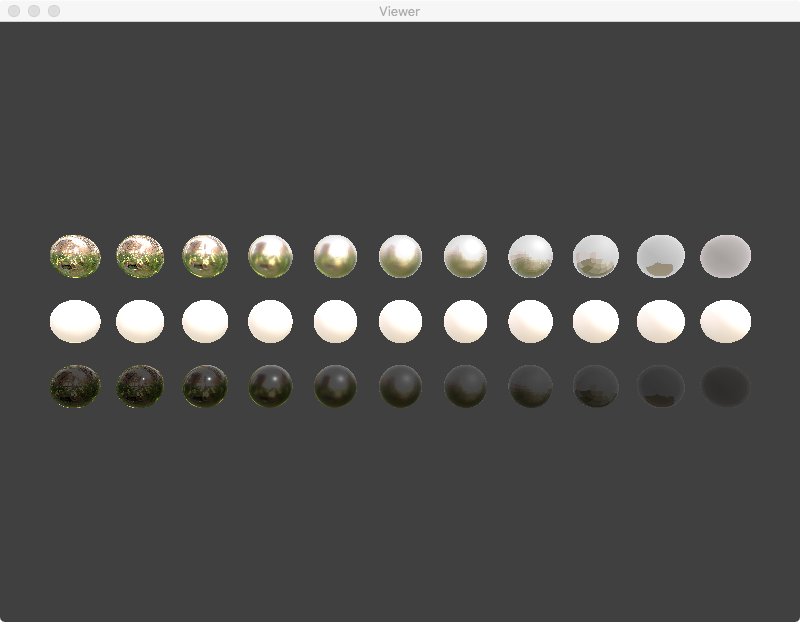

# Papermill Ruins E

## Source

[http://www.hdrlabs.com/sibl/archive.html](http://www.hdrlabs.com/sibl/archive.html)

[https://github.com/KhronosGroup/glTF-Sample-Viewer/tree/glTF-WebGL-PBR/textures/papermill](https://github.com/KhronosGroup/glTF-Sample-Viewer/tree/glTF-WebGL-PBR/textures/papermill)

[https://github.com/ux3d/glTF-Sample-Environments/tree/master/papermill](https://github.com/ux3d/glTF-Sample-Environments/tree/master/papermill)

## License

Maybe [CC BY-NC-SA 3.0](https://creativecommons.org/licenses/by-nc-sa/3.0/)

## Preprocessor

[scripts/papermill.py](../../scripts/papermill.py)

## Screenshot

